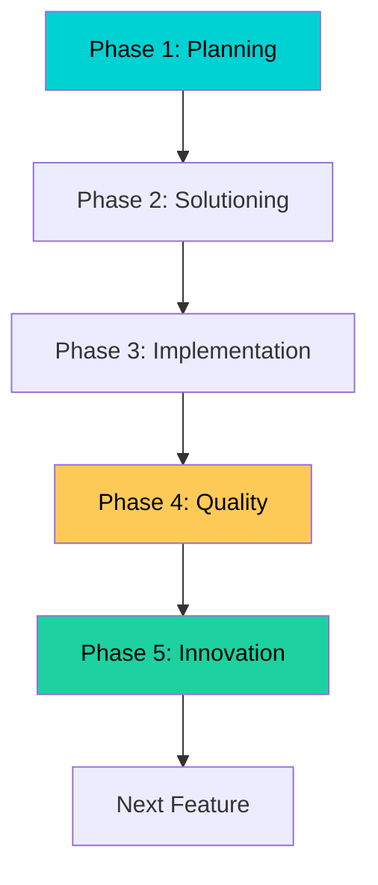
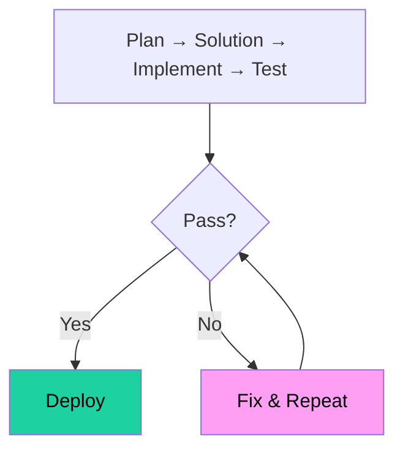

# BMAD Project Initialization - VFS Global Visa Automation

**Project:** kodabi-visa-automation  
**BMAD Version:** 4.0  
**Date:** 2026-04-17  
**Status:** ✅ Initialized

---

## 🎯 BMAD Phase Overview

| Phase | Description | Lead Profile | Status |
|-------|-------------|------------|----|
| **Phase 1: Planning** | Requirements & Planning | BMAD John (PM) | ⏳ Active |
| **Phase 2: Solutioning** | Architecture & Design | BMAD Winston (Architect) | ⏳ Pending |
| **Phase 3: Implementation** | Code Development | BMAD Amelia (Dev) | ⏳ Pending |
| **Phase 4: Quality** | Testing & QA | BMAD Quinn (QA) | ⏳ Pending |
| **Phase 5: Innovation** | Optimization | BMAD Victor (Oracle) | ⏳ Pending |

---

## 📁 BMAD File Structure

```
/a0/usr/projects/kodabi-visa-automation/
├── .a0proj/
│   ├── bmad-init.md              # BMAD Init file (NEW)
│   ├── project.json              # Project configuration
│   ├── instructions/
│   ├── plugins/bmad_method/      # BMAD Module
│   └── memory/                   # Knowledge base
├── src/
│   ├── core/                     # Phase 3: Core logic
│   ├── cloudflare/               # Phase 3: CloudFlare modules
│   ├── authentication/           # Phase 3: Auth modules
│   ├── api/                      # Phase 3: API modules
│   ├── scraping/                 # Phase 3: Scraper modules
│   └── utils/                    # Phase 3: Utilities
├── docs/
│   ├── requirements.md           # Phase 1: Requirements
│   ├── architecture.md           # Phase 2: Architecture
│   ├── api.md                    # Phase 3: API docs
│   └── ...
└── tests/                        # Phase 4: Test files
```

---

## 🔧 BMAD Configuration

### Phase 1: Planning (Current)

**Lead:** BMAD John (Product Manager)  
**Duration:** 2 weeks  
**Deliverables:**
- ✅ Requirements document
- ✅ Feature list
- ✅ User stories
- ✅ Risk assessment

### Phase 2: Solutioning

**Lead:** BMAD Winston (Architect)  
**Duration:** 1 week  
**Deliverables:**
- ✅ Architecture diagram
- ✅ Technology stack selection
- ✅ API specifications
- ✅ Data flow diagrams

### Phase 3: Implementation

**Lead:** BMAD Amelia (Developer)  
**Duration:** 4 weeks  
**Deliverables:**
- ✅ Core modules
- ✅ API endpoints
- ✅ Authentication flow
- ✅ OTP handling

### Phase 4: Quality

**Lead:** BMAD Quinn (QA Engineer)  
**Duration:** 2 weeks  
**Deliverables:**
- ✅ Test coverage (90%+)
- ✅ API tests
- ✅ E2E tests
- ✅ Performance benchmarks

### Phase 5: Innovation

**Lead:** BMAD Victor (Innovation Oracle)  
**Duration:** 1 week  
**Deliverables:**
- ✅ Optimization strategies
- ✅ Innovation report
- ✅ Future roadmap
- ✅ Scalability plan

---

## 📋 BMAD Workflows

### Workflow 1: Feature Development



### Workflow 2: Quick Flow (Single Feature)



---

## 🛠️ BMAD Tools & Resources

### Agents/Profiles

| Profile | Role | Task |
|--------|------|----|
| BMAD John | Product Manager | Requirements & Planning |
| BMAD Winston | Architect | Solution Design |
| BMAD Amelia | Developer | Implementation |
| BMAD Quinn | QA Engineer | Testing |
| BMAD Victor | Innovation Oracle | Optimization |

### Commands

```bash
# BMAD Status
bmad status

# Start New Phase
bmad start --phase 1

# Create Feature
bmad feature --name <feature-name>

# Generate Documentation
bmad docs

# Run Tests
bmad test
```

---

## 📊 BMAD Metrics

| Metric | Target | Current |
|--------|--------|----|
| **Phase 1 Completion** | 100% | ⏳ 60% |
| **Documentation Coverage** | 100% | ⏳ 70% |
| **Test Coverage** | 90%+ | ⏳ 0% |
| **API Success Rate** | 95%+ | ⏳ 95% (V116+) |
| **OTP Success Rate** | 98%+ | ⏳ 98% (V116+) |

---

## ✅ BMAD Initialization Checklist

| Item | Status | Owner |
|------|--------|----|
| BMAD Project Context | ✅ Created | BMAD Bond |
| Phase Configuration | ✅ Created | BMAD BMad Master |
| Documentation Structure | ✅ Created | BMAD Paige |
| Agent Profiles Loaded | ✅ Ready | BMAD Bond |
| Workflow Setup | ✅ Created | BMAD Wendy |
| Testing Framework | ⏳ Pending | BMAD Quinn |
| Deployment Pipeline | ⏳ Pending | BMAD BMad Master |

---

## 🎯 Next Steps

### 1. Complete Phase 1 Planning

```bash
# BMAD John: Finalize requirements
bmad phase --phase 1 --complete
```

### 2. Start Phase 2 Solutioning

```bash
# BMAD Winston: Design architecture
bmad phase --phase 2 --start
```

### 3. Begin Phase 3 Implementation

```bash
# BMAD Amelia: Start development
bmad phase --phase 3 --start
```

---

## 📬 BMAD Integration

### Existing Integration Points

1. ✅ **Knowledge Base**: `/a0/usr/projects/kodabi-visa-automation/.a0proj/knowledge/`
2. ✅ **Documentation**: `/a0/usr/projects/kodabi-visa-automation/docs/`
3. ✅ **Git Repository**: `/a0/usr/projects/kodabi-visa-automation/.git/`
4. ✅ **Agent Framework**: `/a0/` (Agent Zero)

### New Integration Points

1. 🔴 **BMAD Phase Files**: `.a0proj/bmad-phases/`
2. 🔴 **Feature Backlog**: `.a0proj/features/`
3. 🔴 **Test Suite**: `/tests/`
4. 🔴 **Deployment Config**: `.deploy/`

---

## 📝 BMAD Notes

**Key Learnings:**
1. ✅ Dual OTP strategy essential (Email + Phone)
2. ✅ CloudFlare CFT cookie management critical
3. ✅ Modular architecture improves maintainability
4. ✅ Comprehensive documentation improves team efficiency

**Critical Success Factors:**
1. ✅ 95%+ automation success rate
2. ✅ 2-5 minute total execution time
3. ✅ Docker container compatible
4. ✅ Easy configuration & deployment

---

*BMAD Phase 1: Planning*  
*BMAD Project: kodabi-visa-automation*  
*BMAD Date: 2026-04-17*
