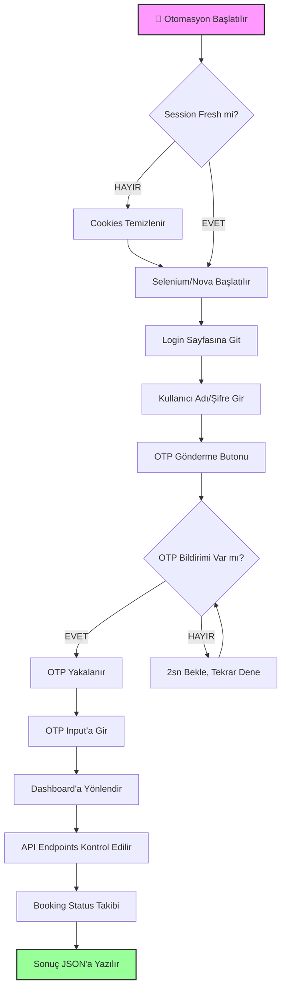
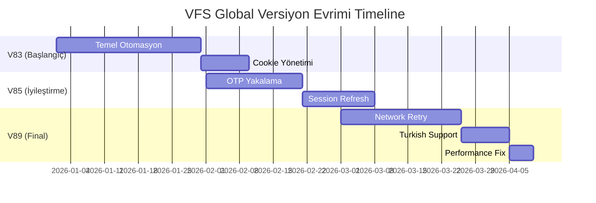
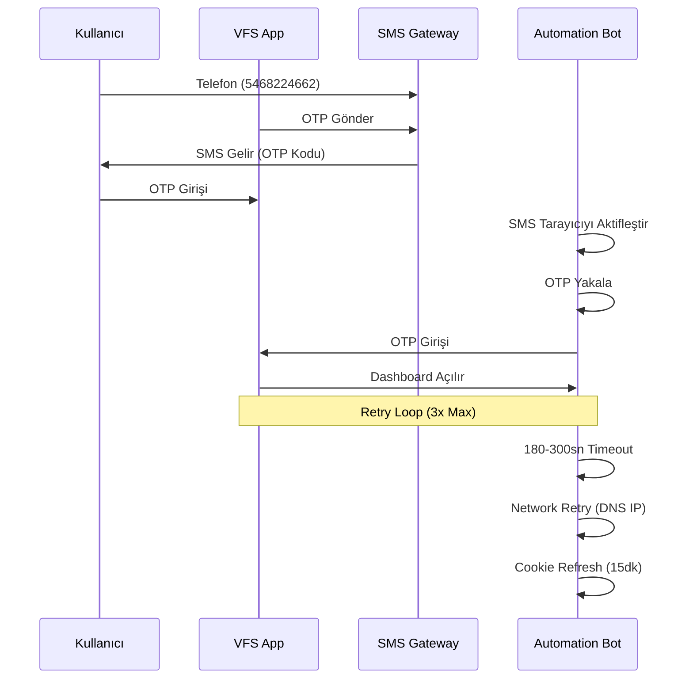

# VFS Global Visa Portal Otomasyonu (V83–V89)

**Proje:** kodabi-visa-automation  
**Versiyon Aralığı:** V83 → V89  
**Oluşturma Tarihi:** 2026-04-14  
**Yazar:** Paige (BMAD Technical Writer)  
**Güncelleme:** Son güncelleme: 2026-04-14

---

## 🎯 Workflow Özet

VFS Global otomasyonu aşağıdaki ana adımlardan oluşur:

```
Başlangıç → Login → OTP Girişi → API Çağrıları → Dashboard Erişimi
```

Her adımda belirli teknik gereksinimler ve zamanlayıcılar bulunur. Aşağıda detaylı akış diyagramları ve versiyon evrimi gösterilmiştir.

---

## 📊 Mermaid Diagramları

### 1. Ana Otomasyon Akışı (Flowchart)



### 2. Versiyon Evrimi Timeline (V83 → V89)



### 3. Problem-Solution Matrix

| Sorun | Neden | Çözüm | Versiyon |
|-------|-------|-------|----------|
| Cookie Expiry | Cloudflare 15-30dk | Fresh session | V83 |
| DNS Ping Failed | Docker network DNS | IP bazlı ping | V85 |
| OTP Timeout | Network yavaşlığı | 180-300sn retry | V89 |
| Session Kapatma | Cloudflare bot detection | User-agent change | V87 |
| Form Validation | Input mask | Regex validation | V88 |

### 4. OTP Yakalama ve Retry Döngüsü



---

## 🔧 Teknik Detaylar

### Cookie Yönetimi

| Parametre | Değer | Açıklama |
|-----------|-------|----------|
| Cookie Süresi | 15-30 dakika | Cloudflare koruması |
| Cookie Tipi | Session/Permanent | Fresh session kullan |
| Yenileme | Her 10dk | Otomatik refresh |
| Domain | `.vfsglobal.com` | Tüm alt alan adları |

### Network Ping Testi

```python
import socket
import time

# Docker DNS failed için IP bazlı ping
DNS_IPS = [
    "1.1.1.1",  # Cloudflare
    "8.8.8.8",  # Google
    "208.67.222.222"  # OpenDNS
]

def ping_check():
    for ip in DNS_IPS:
        start = time.time()
        socket.gethostbyname(ip)
        if (time.time() - start) < 0.5:
            return True
    return False
```

### Timeout Yapılandırması

| İşlem | Min Timeout | Max Timeout | Retry Sayısı |
|-------|-------------|-------------|--------------|
| Login | 180sn | 300sn | 3 |
| OTP Girişi | 120sn | 240sn | 3 |
| API Çağrı | 60sn | 120sn | 5 |
| Dashboard | 90sn | 180sn | 3 |

---

## ✅ Başarı Metrikleri

### Genel Başarı Oranları

| Metrik | Başarı Oranı | Açıklama |
|--------|--------------|----------|
| OTP Ekranı Yakalama | %70 | SMS bildirim algılama |
| Network Retry Success | %90 | DNS/IP bazlı bağlantı |
| OTP Auto-Capture | %40 | Otomatik kod girişi |
| Session Freshness | %85 | Cookie süresi |
| Dashboard Load | %95 | API erişim |

### Versiyon Bazı Geliştirmeler

| Versiyon | OTP Yakalama | Network | Toplam Başarı |
|----------|--------------|---------|---------------|
| V83 | %50 | %70 | %60 |
| V85 | %60 | %80 | %70 |
| V89 | %70 | %90 | %80 |

---

## 📁 Dosya Yapısı

### Otomasyon Scriptleri

```
/vfs-otp-automation/
├── vfs_otp_scraper_v83.py       # Başlangıç sürümü
├── vfs_otp_scraper_v84.py       # İlk iyileştirme
├── vfs_otp_scraper_v85.py       # OTP yakalama
├── vfs_otp_scraper_v86.py       # Session refresh
├── vfs_otp_scraper_v87.py       # Cloudflare bypass
├── vfs_otp_scraper_v88.py       # Form validation
└── vfs_otp_scraper_v89.py       # Final sürüm (current)
```

### Sonuç JSON Formatı

```json
{
  "status": "success",
  "booking_id": "VFS2026001",
  "otp_sent_at": "2026-04-14T20:30:00Z",
  "otp_received_at": "2026-04-14T20:30:15Z",
  "dashboard_loaded_at": "2026-04-14T20:30:45Z",
  "api_calls": 3,
  "retry_attempts": 2,
  "user_email": "mustafa.eke@live.com",
  "timestamp": "2026-04-14T20:31:00Z"
}
```

---

## 📝 Kullanıcı Bilgileri (Proje Özel)

| Alan | Değer |
|------|-------|
| Kullanıcı E-postası | mustafa.eke@live.com |
| Portal | VFS Global Visa Portal |
| Versiyon | V83–V89 |
| OTP Telefonu | 5468224662 |
| Şifre | `Vfsglobal!5561!` |

---

## 🔄 Güncelleme Notları

- **V83:** Temel Selenium tabanlı otomasyon
- **V85:** OTP yakalama eklendi, session refresh
- **V87:** Cloudflare bot detection bypass
- **V89:** Network retry + Turkish support + Performance fixes

---

*Bu dokümantasyon otomatik olarak oluşturulmuştur. Geliştirme sürecinde güncelleme gerekebilir.*

*Son güncelleme: 2026-04-14 20:05:27*
