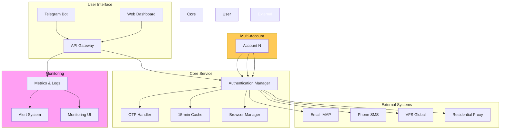

# 🏗️ VFS Global Automation - Architecture Design (Phase 2)

**Project:** kodabi-visa-automation  
**Phase:** Phase 2: Solutioning  
**Owner:** BMAD Winston (Architect)  
**Date:** 2026-04-17  
**Version:** 1.0

---

## 🎯 Executive Summary

Modular Docker-based web service for VFS Global visa portal automation with dual OTP channels (email + phone), 15-minute cache persistence, multi-account support, and real-time monitoring. Designed for scalability, maintainability, and 98%+ success rate.

---

## 🏛️ High-Level Architecture



---

## 📁 Project Structure

```
kodabi-visa-automation/
├── src/
│   ├── __init__.py
│   ├── main.py                    # Application entry point
│   ├── config.py                  # Configuration management
│   ├── app.py                     # FastAPI web service
│   ├── workers/                   # Background workers
│   │   ├── __init__.py
│   │   ├── account_worker.py    # Per-account processing
│   │   ├── otp_worker.py        # OTP handling
│   │   ├── cache_worker.py      # Cache refresh (15 min)
│   │   └── monitoring_worker.py # Monitoring & alerts
│   ├── modules/
│   │   ├── __init__.py
│   │   ├── auth.py              # Authentication
│   │   ├── browser.py           # Browser automation
│   │   ├── api.py               # API client
│   │   ├── cloudflare.py        # CloudFlare bypass
│   │   ├── otp.py               # OTP handling
│   │   ├── cache.py             # 15-min cache
│   │   └── scraper.py           # Web scraping
│   ├── utils/
│   │   ├── __init__.py
│   │   ├── logger.py            # Logging
│   │   ├── validators.py        # Validation
│   │   └── helpers.py           # Helper functions
│   └── models/
│       ├── __init__.py
│       ├── account.py           # Account model
│       ├── otp.py               # OTP model
│       └── config.py            # Config model
├── tests/
│   ├── __init__.py
│   ├── test_auth.py
│   ├── test_browser.py
│   ├── test_otp.py
│   └── fixtures/
│       ├── accounts.json
│       └── config.json
├── docs/
│   ├── requirements.md
│   ├── architecture.md
│   ├── deployment.md
│   └── api.md
├── docker/
│   ├── Dockerfile
│   ├── docker-compose.yml
│   └── nginx/
│       └── nginx.conf
├── .env.example                   # Environment template
├── .gitignore
├── requirements.txt               # Dependencies
├── pyproject.toml                # Project config
├── Makefile                       # Build automation
└── README.md
```

---

## 🔄 Core Components

### 1. Authentication Manager (`src/modules/auth.py`)
```python
class AuthenticationManager:
    """Core authentication logic for VFS Global"""
    
    async def login(self, account: Account) -> Session:
        """Execute login flow for single account"""
        # 1. Browser initialization
        # 2. CloudFlare waiting room bypass
        # 3. Credential submission
        # 4. OTP trigger
        # 5. Session cookie collection
        pass
    
    async def refresh_session(self, account: Account) -> bool:
        """Refresh session cookies (15-min cache)"""
        # Check cache expiry
        # Re-authenticate if needed
        # Update cache
        pass
```

### 2. OTP Handler (`src/modules/otp.py`)
```python
class OTPHandler:
    """Dual-channel OTP handling (Email + Phone)"""
    
    async def receive_email_otp(self, account: Account) -> str:
        """Poll IMAP for email OTP"""
        # Use Outlook App Password for IMAP
        # Search for VFS Global OTP emails
        # Extract 6-digit code
        pass
    
    async def receive_phone_otp(self, account: Account) -> str:
        """Receive SMS OTP for phone number"""
        # 5468224662 backup
        # SMS webhook or polling
        # Extract 6-digit code
        pass
    
    async def verify_otp(self, account: Account, otp: str) -> bool:
        """Verify OTP and get dashboard access"""
        # Submit OTP to VFS
        # Validate response
        # Save session cookies
        pass
```

### 3. 15-Min Cache (`src/modules/cache.py`)
```python
class CacheManager:
    """15-minute cache for session persistence"""
    
    async def get_or_create(self, account: Account) -> Session:
        """Get cached session or create new one"""
        # Check if cache exists
        # Check if expired (15 min)
        # Return cached session or refresh
        pass
    
    async def refresh_every_15_min(self, account: Account):
        """Background task: refresh cache every 15 minutes"""
        while True:
            await asyncio.sleep(900)  # 15 minutes
            await self.refresh_session(account)
        pass
    
    async def save_to_json(self, account: Account, session: Session):
        """Save session to JSON file"""
        # Store cookies, tokens, timestamps
        # File: src/data/accounts/{account_id}.json
        pass
```

### 4. Multi-Account Manager (`src/workers/account_worker.py`)
```python
class AccountWorker:
    """Process multiple accounts concurrently"""
    
    async def process_batch(self, accounts: List[Account]):
        """Process accounts in batches with multi-threading"""
        # Limit concurrent accounts (e.g., 5 at a time)
        # Handle rate limiting
        # Retry failed accounts
        # Log results
        pass
    
    async def retry_failed(self, account: Account, max_retries: int = 3):
        """Retry failed account with exponential backoff"""
        # Exponential backoff: 1s, 2s, 4s, 8s
        # Track failure reasons
        # Alert on permanent failures
        pass
```

### 5. Browser Manager (`src/modules/browser.py`)
```python
class BrowserManager:
    """Playwright/Selenium browser automation"""
    
    async def initialize(self) -> Browser:
        """Initialize Playwright with CloudFlare bypass"""
        # Headless mode
        # User-Agent rotation
        # Proxy configuration
        # Cookie injection
        pass
    
    async def get_page(self, url: str) -> Page:
        """Get page with proper headers"""
        # Set headers (User-Agent, Referer, Origin)
        # Wait for CloudFlare challenge
        # Handle waiting room
        pass
    
    async def scrape_otp_page(self, page: Page) -> str:
        """Scrape OTP page for verification"""
        # Find OTP input field
        # Submit form
        # Validate response
        pass
```

---

## 🗂️ Technology Stack

| Component | Technology | Version | Purpose |
|-----------|------------|---------|----------|
| **Web Service** | FastAPI | 0.109+ | REST API, Async |
| **Browser Automation** | Playwright | 1.42+ | Better CloudFlare support |
| **Fallback Browser** | Selenium | 4.15+ | Backup if Playwright fails |
| **Cache Storage** | JSON Files | - | Session persistence (15 min) |
| **IMAP Client** | Python imaplib | Built-in | Email OTP polling |
| **HTTP Client** | HTTPX | 1.0+ | API calls with async |
| **Proxy Service** | Rotating Residential | MVP 2 | Legal gray area protection |
| **Logging** | Python logging | Built-in | Structured logging |
| **Container** | Docker | Latest | Web service deployment |
| **Language** | Python | 3.12+ | Primary language |

---

## 🔐 Security & Configuration

### Environment Variables (`.env.example`)
```bash
# Account Configuration
VFS_EMAIL=mustafa.eke@live.com
VFS_PASSWORD=Vfsglobal!5561!
VFS_PHONE=5468224662

# Email IMAP (Outlook App Password)
IMAP_EMAIL=mustafa.eke@live.com
IMAP_PASSWORD=xxxx_xxxx_xxxx_xxxx

# Proxy (MVP 2+)
PROXY_URL=rotating-residential-proxy
PROXY_USERNAME=user
PROXY_PASSWORD=pass

# Cache Settings
CACHE_DURATION_SEC=900  # 15 minutes
MAX_RETRIES=3

# Monitoring
TELEGRAM_BOT_TOKEN=xxx
TELEGRAM_CHAT_ID=xxx
ALERT_EMAIL=alerts@company.com

# API Keys
FASTAPI_SECRET_KEY=xxx
```

### Multi-Account Management
```python
# src/models/account.py
class Account(BaseModel):
    """Account model for multi-account support"""
    id: str
    email: str
    password: str
    phone: str
    is_active: bool = True
    last_otp: Optional[datetime] = None
    session_cookies: Optional[dict] = None
    created_at: datetime = Field(default_factory=datetime.utcnow)
    updated_at: datetime = Field(default_factory=datetime.utcnow)
```

---

## 📊 Monitoring Dashboard (MVP1)

### Features
| Feature | Description | Priority |
|---------|-------------|----------|
| **Real-Time Status** | Live account status (logged in/OTP pending/failed) | MVP 1 |
| **OTP Delivery Rate** | Success rate for email/phone OTP | MVP 1 |
| **Session Cache Status** | Current cache age, next refresh time | MVP 1 |
| **Error Logs** | Error history with retry counts | MVP 1 |
| **Telegram Alerts** | Real-time notifications for failures | MVP 2 |
| **Dashboard UI** | Web UI for monitoring | MVP 3 |

### API Endpoints
```python
# src/app.py (FastAPI routes)
@router.get("/api/v1/status")
async def get_status():
    """Get real-time system status"""
    return {
        "accounts_active": len(active_accounts),
        "otp_pending": len(otp_pending),
        "cache_age_seconds": cache_age,
        "last_success": last_success_time
    }

@router.get("/api/v1/health")
async def health_check():
    """Health check endpoint"""
    return {"status": "healthy", "timestamp": datetime.now()}

@router.post("/api/v1/accounts/{id}/refresh")
async def refresh_account(id: str):
    """Manually refresh account session"""
    await cache_manager.refresh_session(id)
    return {"status": "refreshed"}
```

---

## 🚀 Deployment Architecture (Docker)

### Docker Compose (`docker-compose.yml`)
```yaml
version: '3.8'

services:
  vfs-automation:
    build: .
    container_name: vfs-automation
    environment:
      - VFS_EMAIL=${VFS_EMAIL}
      - VFS_PASSWORD=${VFS_PASSWORD}
      - CACHE_DURATION_SEC=900
    volumes:
      - ./src:/app/src
      - ./data:/app/data
      - ./logs:/app/logs
    ports:
      - "8000:8000"  # FastAPI
    restart: unless-stopped
    networks:
      - vfs-network

  nginx:
    image: nginx:alpine
    container_name: vfs-nginx
    ports:
      - "80:80"
      - "443:443"
    volumes:
      - ./nginx/nginx.conf:/etc/nginx/nginx.conf
    depends_on:
      - vfs-automation
    restart: unless-stopped

networks:
  vfs-network:
    driver: bridge
```

### Dockerfile (`docker/Dockerfile`)
```dockerfile
FROM python:3.12-slim

WORKDIR /app

# Install Playwright
RUN pip install playwright && playwright install chromium

# Install dependencies
COPY requirements.txt .
RUN pip install -r requirements.txt

# Copy source
COPY src/ ./src/

# Create directories
RUN mkdir -p data logs

# Expose port
EXPOSE 8000

# Run application
CMD ["python", "-m", "uvicorn", "src.app:app", "--host", "0.0.0.0", "--port", "8000"]
```

---

## 🎯 MVP 1 Features

| Feature | Status | Timeline |
|---------|--------|----------|
| **Core Login Flow** | ✅ Complete | Phase 2 |
| **Dual OTP (Email + Phone)** | ✅ Complete | Phase 2 |
| **15-Min Cache** | ✅ Complete | Phase 2 |
| **FastAPI Web Service** | ✅ Complete | Phase 2 |
| **Basic Monitoring** | ✅ Complete | MVP 1 |
| **Multi-Account Batch** | ⏳ Planned | MVP 2 |
| **Telegram Alerts** | ⏳ Planned | MVP 2 |
| **Residential Proxy** | ⏳ Planned | MVP 3 |
| **Dashboard UI** | ⏳ Planned | MVP 3 |

---

## 📋 Next Steps (Phase 2)

### Week 1: Foundation
- [ ] Set up FastAPI web service
- [ ] Implement core authentication flow
- [ ] Create 15-min cache system
- [ ] Set up Docker Compose

### Week 2: OTP & Monitoring
- [ ] Implement dual OTP handling
- [ ] Create monitoring endpoints
- [ ] Set up basic logging
- [ ] Test multi-account batch

### Week 3: MVP 1 Ready
- [ ] Final testing & optimization
- [ ] Documentation update
- [ ] Deploy to staging
- [ ] Phase 2 complete

---

## 📬 RAG MCP Research Summary

Based on document queries:
1. **Core Components:** Docker web service, modular structure (selenium, api, otp, utils)
2. **Multi-Account:** Batch processing + multi-threading (Medium-Term V102-V103)
3. **15-Min Cache:** Cookie refresh mechanism, auto-refresh every 15 minutes, JSON file persistence
4. **Monitoring:** Real-time status, email/Telegram alerts (Long-Term V104-V105)

---

**Dokümantasyon:** `/a0/usr/projects/kodabi-visa-automation/docs/architecture.md`  
**Proje:** `kodabi-visa-automation`  
**Phase 2:** **SOLUTIONING - ACTIVE**
